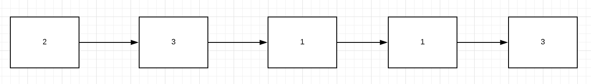

# FindingThesis
A programming puzzle ! 

## ❓ Problem Statement: 

One day a mathematician by name Ramakrishna was travelling on a 🚂 Train, which is fully crowded  👬👬👬👬 
- there's no space to walk through the aisle, 
- Ramakrishna is travelling with a purpose - to submit his final thesis paper 📄 

### ‼️ Plot twist - 
His conversation with his fellow passenger Robert lands him in a situation to solve an interesting problem 
- Robert hides the mathematician thesis paper in one of the compartments of the train
- Evil as he is, Robert is also a bit of a softy. Considering the train is packed Robert equips Ramkrishna with a JETPACK
- The Jetpack is a wearable that can be used to hop from one compartment(coach) to another
- In each compartment a threshold value for JETPACK is placed
- the JETPACK cannot jump over more coaches than the Threshold value

Eg: 
- if a JETPACK is in compartment 2 where threshold value is 4, the JETPACK in one hop can max move to compartment 6 from 2, 
- however user can choose to land anywhere between 3-6, 
- Ramakrishna has to use the JETPACK to find his Thesis - *in minimum possible number of hops.*

So, Let's write a program for this 

#### ▶️ Input 
- number of compartments as inputs, 
- takes JETPACK threshold values for each compartment, 
- and the value of the compartment where the thesis paper is hidden, 

#### ◀️ Output
- return the minimum hops Ramkrishna has to make to find his thesis paper.

Assumption: Ramakrishna must alwas start from compartment 1 in the train.
 
#### 🎯 Example : 

The Thesis is hidden in compartment 5. Here is a sample set of compartments as input -> values in each box are their respective JetPack Thresholds.

#### ◀️ Output:
2 

#### 🤔 Reasoning:
Path: 
1->3>4->-5  : number of hops 3
1->2->5     : number of hops 2

# ✅ Solution
A solution to the Finding Thesis programming puzzle. [See Code.](https://github.com/vinaywadhwa/FindingThesis/blob/master/FindingThesis.java)

## 🔣 Summary: 

This solution is recursive. There may be better solutions for this problem out there but you may find this particular one uniquely elegant.
Besides checking for sane input and handling edge cases, this solution relies mainly on a recursive function, namely findMinHops() to find the minimum hops from any given index (the first one, in this case) to the desired train compartment.

## ▶️ How to provide input  
For simplicity, the following three constants simulate the user input (we don't want to get into the `Scanner` mess) 

- SAMPLE_INPUT_NO_OF_COMPARTMENTS - Represents no of compartments in the train
- SAMPLE_INPUT_NO_OF_COMPARTMENTS - The compartment number (0 index based, for the sake of simplification) where the Thesis exists.
- SAMPLE_INPUT_NO_OF_COMPARTMENTS - Jetpack Threshold values for each compartment.

## 📒 Notable Features
Here are some notable features of this solution

### ©️ Caching
This program implements a caching mechanism for the sake of performance optimisation. Notice the minHopsCache array.
- A cache which helps avoid duplicate traversals to find minimum hops from a given starting index in compartments to the SAMPLE_INPUT_THESIS_INDEX. 
- The index of the array represents the starting index and value at that index is the minimum no of hops required to reach SAMPLE_INPUT_THESIS_INDEX from that starting point/index.

### 🔬 Edge cases handling
The solution assumes and handles some edge cases. More might be needed, but this is what we have right now
- if the thesis lies at zero'th index (first train compartment) itself, we dont need to hop at all! 
- if the thesis lies at first index (second train compartment), all we need is a single hop (since we are assuming jetpack threshhold is always non-zero, atleast ONE)

### 🤪 Validation of user input
We also have some test cases (not JUNIT, just simple checks) to check if the input provided by the user/sample user input declared in this class is valid as per the assumptions stated in the problem statement.
- No of compartments can't be zero or negative
- Thesis can't be in a train compartment with negative index
- Thesis can't be in a train compartment with index greater than total no of train compartments
